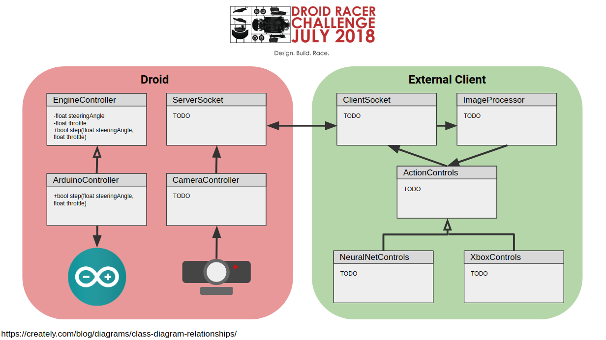

# Droid Racer Project
Griffith Innovate 2018

## Summary
A Queensland University of Technology (QUT) hosted challenge to universities across the nation to create an 
automonous self-driving RC car to traverse an obstacle course.

Details can be found at [qutrobotics.com/2018](https://qutrobotics.com/2018/)

## Setup
OpenCV is required for both the C++ and Python sockets.

- [Ubuntu Installation](https://docs.opencv.org/trunk/d7/d9f/tutorial_linux_install.html)

## Structure

### Droid
The droid directory is code exclusive to running on an edge device with the RC car. In this example, the code will run
on a Raspberry Pi 3 and connect to both an Arduino and webcam.

The droid code will connect with a client using a server WIFI socket. This will allow the edge device to interact with remote
processing. An image is taken from the webcam at the current time and sent over the socket to be processed. In return,
the client will send back an angle for the wheels and a value for the throttle.

The angle and throttle are sent to the Arduino controller to be serialized and sent to the Arduino device. The Arduino
interacts with the physical properties of the car by sending a voltage to the steering and engine.

### Client
The client is a remote device (laptop, desktop, smart-phone etc) that sends a connect request to the droid. The purpose
of the client is to process incoming images, calculate the steering angle and throttle, and send back the information
to the droid. 

The processing of the controls is decoupled from the interaction with the controls to allow experimentation amongst
image processing techniques. For example: lane detection and convolutional neural network processing techniques can 
be developed independently without re-write of controller or socket code.

### Machine Learning
In order to perform machine learning the following steps are required:
1. Drive manually around track
2. Store image at current timestep with corresponding action
3. Train model from image and labeled action
4. Load model for real time processing

## Acknowledgements
- Cailen Robertson
- Ryoma Ohira
- Matthew Bourgeois
- Aiden Mcmillan
- Matthew Lee
